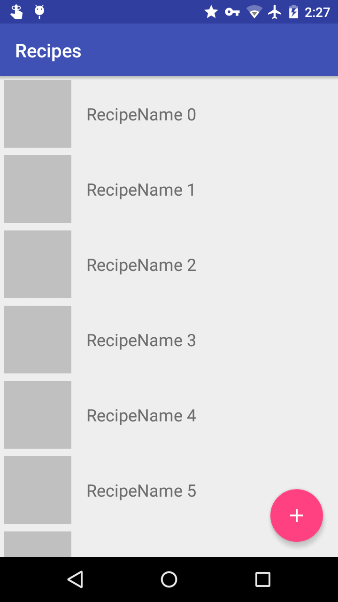

## Injection
Your class has to extend BaseActivity

Use @Inject on the repository variable

Call getComponent().inject(this);

```java
	@Inject
    Repository mRepository;

    @Override
    protected void onCreate(Bundle savedInstanceState) {
        super.onCreate(savedInstanceState);
        setContentView(R.layout.activity_main);
        
        getComponent().inject(this);
    }
```

NOTE: If DaggerApplicationComponent is not found you must do Build -> Rebuild Project

## ImageLoader

Used to load and save images (Recipe imagePath is from this)

ImageLoader.loadImageOnto(imagePath, R.drawable.empty_image)
ImageLoader.saveImage(context, Bitmap, recipeId) //Returns the imagePath

## Screenshots

