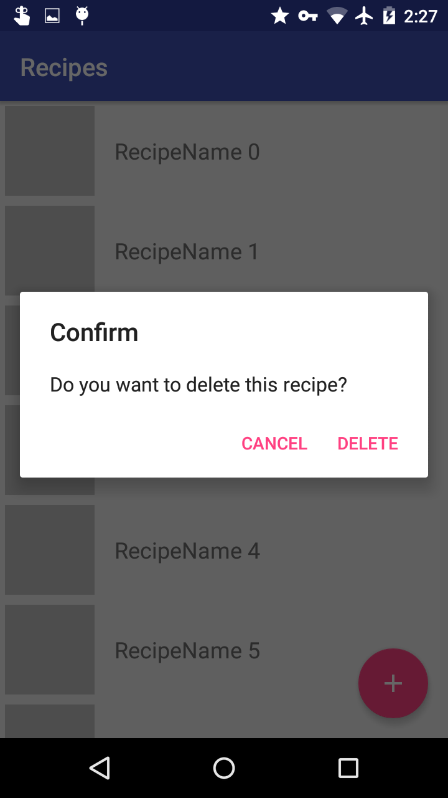

## Injection

The project uses the dagger2 (https://google.github.io/dagger/) dependency injection library.

The method injection/NetworkModule/providesRepository gives the repository everywhere @Inject Repository mRepository; is used.
So returning MockRepository in that method is equivalent to:
```java
@Inject Repository mRepository = new MockRepository();
```

LocalDatabaseRepository is the real database that actually saves and loads recipes to the internal storage, while Mockrepository is just a list of recipes that is reset when the app is restarted.

Example injection:
```java
	@Inject
    Repository mRepository;

    @Override
    protected void onCreate(Bundle savedInstanceState) {
        super.onCreate(savedInstanceState);
        setContentView(R.layout.activity_main);
        
        getComponent().inject(this);
    }
```

NOTE: If DaggerApplicationComponent is not found you must do Build -> Rebuild Project

## Data

The real database (LocalDatabaseRepository) uses the Sugar ORM library (http://satyan.github.io/sugar/) to save the recipes.

## ImageLoader

Used to load and save images (You get imagePath from here)

```java
ImageLoader.saveImage(context, Bitmap, recipeId) //Returns the imagePath

ImageLoader.loadImageOnto(imagePath, R.drawable.empty_image, targetImageView)
```

## Screenshots


